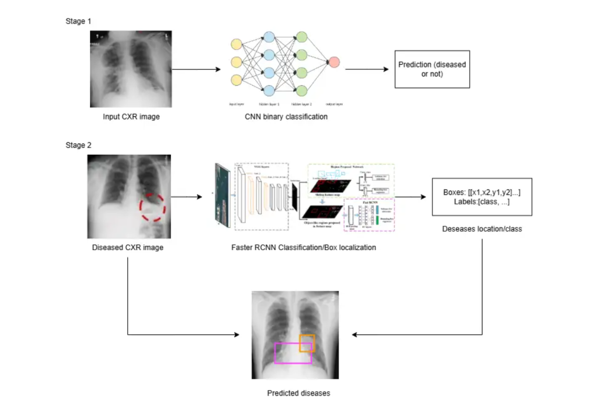

# ChestX-Det10-CNN-Object-Detection

This project focuses on classifying chest X-ray images using a basic Convolutional Neural Network (CNN). The goal is to perform a two-stage classification:
1. **Binary Classification**: Separate images into two categories: `Normal` and `Disease Present`.
2. **Multi-class Classification**: Further classify the diseased images into specific disease categories, such as `Fibrosis`, `Mass`, or `Nodule`.
3. **Location detection**: Identify the location of diseases present in the image.

---

## Dataset

### **Source**
https://www.kaggle.com/datasets/ztamnaja/chestxdet10dataset/data

### **Preprocessing**
- Images are resized to 128x128 pixels for consistency.
- Pixel values are normalized to the range `[0, 1]`.

---

## Model Architecture

### **1. Binary Classification**
**Objective**: To determine whether a chest X-ray image contains a disease or not.  

### **Model**
- **Architecture**: Simple CNN  
- **Input**: Grayscale chest X-ray images resized to `224x224`.  
- **Output**: Binary label  
  - `0`: Normal  
  - `1`: Disease Present  
- **Loss Function**: `BCEWithLogitsLoss`  

### **Metrics**:  
  - Recall (primary focus)  
  - Precision  
  - F1 Score  
  - Accuracy  
### **Optimization**  
- Hyperparameters are tuned using **Optuna** to maximize **Recall**.  
---

### **2. Multi-Class Classification / Location Detection**
**Objective**: To classify diseased images into specific disease categories and detect disease locations.  

### **Model**
- **Architecture**: Faster R-CNN with ResNet-50 Backbone  
- **Input**: Grayscale chest X-ray images  
- **Output**:  
  - Multi-class labels representing specific disease categories  
  - Bounding boxes for disease location detection  

### **Metrics**
- Multi-class classification metrics:  
  - Accuracy  
  - Recall  
  - Precision  
  - F1 Score  
- Object detection metrics:  
  - Mean Average Precision (mAP)  

## **Architecture**

---

### **Dependencies**
- Python 3.10.15
- PyTorch 2.5.1
- torchvision 0.20.1
- matplotlib
- numpy/pandas

